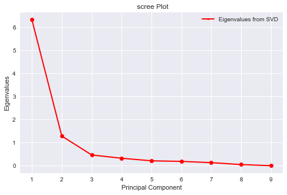

```{r setup, echo=FALSE, evaluate=TRUE}
setwd("~/Desktop/Michigan/computational_methods/final project/group component")
```

#Introduction 

This tutorial covers the basics of Principal Component Analysis (PCA) and its applications to predictive modeling. The tutorial teaches readers how to implement this method in STATA, R and Python. Examples can be found under the sections principal component analysis and principal component regression.

PCA is a statistical procedure for dimension reduction. It transforms the original variables in a dataset, which might be correlated, into new covariates that are linear combinations of the original variables. These new predictors are uncorrelated and orthogonal to each other. These variables are called principal components (PC).

The tutorial uses one dataset that is part base R and one dataset that is part of the package "faraway." STATA users who wish to follow the examples on their computer will need to use the command **write.data(data_name, path=”path/to/local_folder”)** within R to write the data as a .dta file. Please see link for more information on [writing .dta files from R](https://stat.ethz.ch/R-manual/R-devel/library/foreign/html/write.dta.html). Similarly, Python users can export the datasets from R into a csv format with **write.csv(dataset, "filename.csv")**. 

##Principal Component Analysis {.tabset}

###Data
This example uses the dataset **USArrests**. It contains information about murder, rape and assault statistics in the USA in 1973. The data contains 50 observations, one entry for each state. It also has four columns: murder arrests (per 100, 000),  assault arrests (per 100,00), UrbanPop (percent urban population), and rape arrests (per 100,000).

While the data is relatively low dimensional, the variables are highly correlated and therefore PCA can help summarize the data. Additionally, readers might find it easier to grap the basics of PCA with a small dataset than a large one. 

###STATA

PCA helps researchers reduce the dimensionality of their data. Doing so is particularly important in the presence of highly correlated variables. For that reason, we examine the correlation between the variables in **USArrests**.

In STATA, the command **corr** followed by the variables of interest provides a correlation matrix: 

```{r echo=FALSE, out.width='40%',fig.align="center"}

```
Clearly, variables in the data are highly correlated. We would like to summarize the information in the data in fewer variables than those originally in the dataset. PCA can help us do so. 

To conduct PCA in STATA, we use the syntax **pca varname** where varname corresponds to the variables for which we wish to find principal components. It is usually recommended to normalize variables before conducting PCA in order to get variables on a common scale. Luckily, **pca** normalizes the variables specified in the command: 

```{r echo=FALSE, out.width='50%',fig.align="center"}

```
**pca** provides two tables:

The first table shows the eigenvalues for each component, the difference in eigenvalue size between the components, the proportion of variation explained by each component and the cumulative proportion explained. For example, the first two components already explain 87 percent of the variation in the data. 

The second table provides the eigenvectors. This table allows users to inpect exactly how each variable loaded onto each component. The coefficients on each variable are the linear combinations that make up the each compoent. For example UrbanPop loaded low on Component 1, but high on Component 2. 

These two tables can be summarized graphically. The command **screeplot** plots the eigenvalues corresponding to each component. 

```{r echo=FALSE, out.width='70%',fig.align="center"}

```

```{r echo=FALSE, out.width='50%',fig.align="center"}

```

Clearly, as the the number of components increases the eigenvalue decreases. For users interested in additional information on graphing options in STATA than what has been specified above, please review the [STATA documentation on two-way graphs](https://www.stata.com/manuals13/g-2graphtwowayline.pdf). 
 
 We can also plot cumulative variation explained by each component if we make our own graph. This plot can be created with the following lines of STATA code:
```{r echo=FALSE, out.width='40%',fig.align="center"}

```

The code about looks for the **e()** class variables in the environment and places the information in a matrix speficied by **mat**. Then it creates a variable eigenvalues of the length observations in the dataset. It then creates variables for percent of variation explained and the components. The code above produces the following graph: 

```{r echo=FALSE, out.width='50%',fig.align="center"}

```

As indicated in the **pca** table, the plot shows that the first two components explain close to 87 of the variation in the data.

Considering that the first two component explain the vast majority of the variation in the data, we explore these two components further. Specifically, STATA allows users to inspect how variables load on to each component using the loading command **loadingplot**. This command plots the coefficients seen in the second table outputed by **pca**. The command default is to plot the coefficients for the first two components. Users interested in changing the default can do so using the option **factors**. Users can learn more at the [STATA website](https://www.stata.com/manuals13/mvscoreplot.pdf).


```{r echo=FALSE, out.width='70%',fig.align="center"}

```
```{r echo=FALSE, out.width='50%',fig.align="center"}

```
Rape, Assault and Murder load highly on Component 1, but quite low on Component 2. Conversely, UrbanPop loads highly on Component 2 and low on Component 1. 

A similar plot can be made of the loading of each observation on either of the first two components using the command **scoreplot**. This command can be useful to idenfity clustering among observations, which might provide users further insight into the important patterns in the data. The command is specified in the following way:

```{r echo=FALSE, out.width='80%',fig.align="center"}

```
```{r echo=FALSE, out.width='50%',fig.align="center"}

```

Again, the command default is to plot the loadings of the first two components. The options mlabel and mlabsize are simply specifying the text options to be used in the plot. According to the graph, observations are fairly evenly distributed along the first and second component. It is possible to discern some possible clustering by region. Souther states seem to load heavily on component 1 while Midwestern state load heavily on Component two and not on component 1. There are exceptions to these trends and it is not uniform throughout. 

STATA also provides an option to obtain a measure of sampling adequacy via the Kaiser-Meyer-Olkin measure of sampling adequacy. This measure can be obtained using the command **estat kmo**. For additional information on [**estat**](https://www.stata.com/manuals13/svyestat.pdf) and [kmo test](http://www.statisticshowto.com/kaiser-meyer-olkin/)
```{r echo=FALSE, out.width='40%',fig.align="center"}

```
Usually, a KMO of greater than 0.5 suggest the data is suitable for PCA. Clearly, our data is suited for this method. 


###R

<style>
p.comment {
background-color: #E6E6FA;
padding: 15px;
border: 10px red;
margin-left: 20px;
margin-right: 20px;
border-radius: 10px;
font-style: slanted;
}

</style>

<p class="comment">
$\bullet~~$ In the first part of the tutorial, we deal with the simple arguments of the principle component analysis, including the precedure to get the number of predictors should be represented in a model and how to plot the relevent graphs. First, we load the appropriate data and packages into the environment. The primary R function used in this tutorial **prcomp** belongs stats package. In this case, the package was loaded automatically. We first take a glance at the number of variables and the correlation matrix of the data:
</p>

```{r}
library(faraway)
library(MASS)
library(lars)
library(pls)
library(factoextra)
data("USArrests")
dim(USArrests)
str(USArrests)
head(USArrests)
options(digits=3)

p<-ncol(USArrests); p # No. of variables
R<-cor(USArrests); R # Display the correlation matrix
```

<p class="comment">
$\bullet~~$ Now, the first procedure for Principal Component Analysis is to **scale** and **center** the data using **prcomp** command. This command is both convenient and useful, helping you to subtract each observation value by its mean and then divide the result by the standard deviation. Then, we can use print and summary commands to see the **rotation**, **standard deviation** and **proportion of variance** each component contributes to the dataset, and use **fviz_fig** in package **factoextra** to plot a nice formatted scree plot.
</p>

```{r, fig.width = 6}
USArrests <- as.data.frame(USArrests)
arrests.pca <- prcomp(USArrests,center = TRUE,scale. = TRUE)
names(arrests.pca)
print(arrests.pca)
summary(arrests.pca)
fviz_eig(arrests.pca) # Visualization of variance explained by each component
```

<p class="comment">
$\bullet~~$ In the summary part, the line **Proportion of Variance** represents how much percentage of the variance is explained by each component. Here the first component explains $62\%$ of the variability, the second component explains $24.7\%$ of the variance and so on... Then the line **Cumulative Proportion** represents the percentage of variance explained by **first k elements**. Specifically, PC3 column gives the value 0.9566, which means if we include the first 3 components, then $95.66\%$ of the variance is explained.
</p>

<p class="comment">
$\bullet~~$ For edification only, suppose the model has n predictors, the purpose of PCA is to choose the minimum k predictors to explain a certain percent of variation:
$$\sum_{i=1}^k \lambda_i \ge \sum_{i=1}^n(1-\alpha) \lambda_i$$
, where $\alpha$ could take 0.05, 0.01, etc.
</p>

<p class="comment">
$\bullet~~$ We can install the package **factoextra** to improve the visualization of the **scree plot** (as shown above), **variable plot**, **individual plot** and **biplot**, which we will demonstrate below. 
</p>

```{r, fig.height=5, fig.width=6}
# Variable plot
fviz_pca_var(arrests.pca,
             col.var = "contrib", # Control variable color using their contributions to the PC
             gradient.cols = c("#70f6ff", "#00AFBB", "#ffd224",
                               "#d8ac00", "#FC4E07", "#a73203"),
             repel = TRUE,     # Avoid text overlapping
             ggtheme = theme_minimal()
             )
# Biplot
fviz_pca_biplot(arrests.pca, repel = TRUE,
                col.var = "#2E9FDF", # Variables color
                col.ind = "#696969"  # Individuals color
                )
```

<p class="comment">
$\bullet~~$ **Interpretation of variable plot:** The variable plot gives the **coordinates** and the **intensity** of each component based on the **normalized principal component scores** on the first two components, with the intensity labeled by different colors. As the graph suggests, the variables **Murder, Assault and Rape** are closer to each than the variable **UrbanPop**, indicating that the former three variables are of **higher similarity**.
</p>

<p class="comment">
$\bullet~~$ **Interpretation of biplot:** The biplot primarily gives the **coordinates** of each observation and variable based on the **rotation (loading)** on the first two components. Again, the shorter distance between two observations indicates the higher similarity between them.
</p>

<p class="comment">
$\bullet~~$ The x and y coordinates of variables and individuals (corresponding to the first principal component and second principal component) could be computed by extracting the **rotation matrix** and **standard deviation** of each component and multiplying them accordingly. For example, the x coordinating of each vector is the product of the rotation matrix and the standard deviation of PC1. We accomplish it by using the following commands:
</p>

```{r}
# Compute the coordinate of variables
func_varcoord <- function(rotation, comp.std){
  rotation * comp.std} # First create a function computing the multiplication of rotation and component standard deviation
rotation <- arrests.pca$rotation
std <- arrests.pca$sdev
varcoord <- t(apply(rotation, 1, func_varcoord, std))
varcoord[,1:2] # Compute only PC1 and PC2
```

<p class="comment">
$\bullet~~$ The above table gives the **x coordinates (PC1 column)** and **y coordinates (PC2 column)** corresponding to Murder, Assault, Rape and UrbanPop, respectively. You can double check to verify that the result is indeed the correct coordinates.
</p>

###Python

This section illustrates PCA method in Python, focusing primarily on sklearn library to conduct PCA. We will mainly use the function **sklearn.decomposition.PCA(n_components=None, copy=True, whiten=False)**. The underlying implementation of this function is to use Singular Value Decomposition of the data to project it to a lower dimensional space, thus results to linear dimensionality reduction. It uses the LAPACK implementation of the full SVD or a randomized truncated SVD by the method of Halko et al. 2009, depending on the shape of the input data and the number of components to extract. Here we use **PCA()** and **np.cumsum**:

```{r,eval=FALSE, echo=TRUE}
# normalized the data for PCA
df_scaled = preprocessing.scale(df.iloc[:,range(1,5)])
df_pca = df.iloc[:,range(1,5)]
# using sklearn.decomposition.PCA to conduct PCA to the data
pca = PCA()
pca.fit(df_pca)
#cumsum the explained variance ratio to find how many PCs we should choose
np.cumsum(pca.explained_variance_ratio_)
```


```{r, echo=FALSE, out.width='60%',fig.align="center"}
knitr::include_graphics('python1.png')
```

In the implementation of PCA method in python, it conducts SVD to the normalized dataset. By doing that, we could get the covariance matrix’s eigenvalues and eigenvectors. We showed the eigenvalues in the above table, the eigenvalues accounts for each component’s explained variance. We also showed the proportion of variation explained by each component and the cumulative proportion explained. We see that the first two components already explain 87 percent of the variation in the data. Here we use **np.cov**:

```{r, eval=FALSE, echo=TRUE}
# get the covariance matrix of data
cov_mat = np.cov(df_pca.T)
# conduct SVD to get eigenvalue and eigenvector
eigen_vals, eigen_vecs = np.linalg.eig(cov_mat)
eigen_vecs.shape 
```

The table below provides the eigenvectors of the covariance matrix. It shows how each variable is loaded onto each component. 

```{r echo=FALSE, out.width='70%',fig.align="center"}

```

Interestingly, we could find that these PC loadings give us some insights to explain the PC components. For example, PC1 approximately does an average to the all original features. On the other hands, PC2 puts our original features to different directions. Below we show the code to plot this data. The main comman is **plt.plot**:
 
```{r, eval=FALSE, echo=TRUE}
# generate the Scree plot for PCs
fig = plt.figure(figsize=(8,5))
sing_vals = np.arange(4) + 1
plt.plot(sing_vals, np.cumsum(pca.explained_variance_ratio_), linewidth=2)
plt.title(' cumulative variation  Plot')
plt.xlabel('Principal Component')
plt.ylabel(' cumulative variation ')
plt.show()
```

 
The explained variance of the PCs can be summarized graphically. We used scree plot to show the variance for each PC and we could choose how many PCs we want to use to explain the whole original dataset by finding a elbow point of the scree plot. The following graph is the scree plot of our PCA result.

```{r echo=FALSE, out.width='60%',fig.align="center"}

```

Clearly, as the the number of components increases the eigenvalue decreases.

We can also plot cumulative variation explained by each component.

```{r echo=FALSE, out.width='60%',fig.align="center"}

```
The plot shows that the first two components explain close to 87% of the variance in the data. This plot is a reflection of the information provided by the upper table in the command pca. 

We can see how the original variables load on each principal component. This can be done using **pca.components** and **pca.transform**.
```{r, echo=TRUE, eval=FALSE}
# extract the first two PC loadings
xvector = pca.components_[0]
yvector = pca.components_[1]

xs = pca.transform(df_pca)[:,0]
ys = pca.transform(df_pca)[:,1]
```

From the results above, we decide to choose the first two PCs to accounts for our original dataset given that they could explain the vast majority of the variation in the dataset. We can show how the variables load onto each these two PCs. 

```{r echo=FALSE, out.width='60%',fig.align="center"}

```

We can see for PC1, Rape, Assault and Murder load nearly the same, UrbanPop’s loading is slightly smaller. PC1 approximately does an average to the all original features. Conversely, UrbanPop loads negatively high on Component 2. The code to create a biplot is shown below:

```{r, echo=TRUE, eval=FALSE}
# generate the Biplot for PCs
for i in range(len(xvector)):
# arrows as vectors onto PC axes
    plt.arrow(0, 0, xvector[i]*max(xs), yvector[i]*max(ys),
              color='r', width=0.0005, head_width=0.0025)
    plt.text(xvector[i]*max(xs)*1.2, yvector[i]*max(ys)*1.2,
             list(df_pca.columns.values)[i], color='r')

for i in range(len(xs)):
# circles as points onto PC axes
    plt.plot(xs[i], ys[i], 'bo')
    plt.text(xs[i]*1.2, ys[i]*1.2, list(df_pca.index)[i], color='b')

plt.title('Biplot')
plt.xlabel('PC 1')
plt.ylabel('PC 2')
plt.show()             
```


A Biplot is an enhanced scatter plot that uses both points and vectors to represent the dataset’s structure. As used in PCA, the axes of the biplot are a pair of principal components, here we used PC1 and PC2. 

```{r echo=FALSE, out.width='70%',fig.align="center"}
knitr::include_graphics('python6.png')
```

We can see that the observations are fairly evenly distributed along the first and second component. It is possible to discern some possible clustering by region. Southern states seem to load heavily on PC1 while Midwestern state load heavily on PC2 and not on component 1. There are exceptions to these trends and it is not uniform throughout. 

##Principal Component Regression {.tabset}

###Data
Seatpos provides information on drivers’ preference for seat position. The data has 38 rows. The variables included are age (years), weight (pounds), HtShoes (height in shoes in cm), Ht (height bare foot in cm), seated (seated height in cm), arm (lower arm length in cm), thigh (thigh length in cm), leg (lower leg length in cm), hip center (horizontal distance of midpoint of the hips from a fixed location in the car in mm). 

We consider  hip center as the response in the principal component regression and the other remaining variables as potential predictors. 


This dataset forms part of the Faraway package. Please read this [link](https://cran.r-project.org/web/packages/faraway/faraway.pdf) for more information.

###STATA
Imagine you wish to construct a model to predict seat preference based on driver's data using the R dataset seatpos. 

First, you examine the correlation matrix using the same command taught in the previous section:

```{r echo=FALSE, out.width='60%',fig.align="center"}

```

Including all covariates is ill advised considering the correlation between predictors.  You wish to follow PCA as a way to reduce correlation issues. 

Again, using the command **pca**, we obtain the following information:

```{r echo=FALSE, out.width='70%',fig.align="center"}

```

The first component has the largest eigenvalue and therefore explains most of the variation in the data. Just the first three components already explain over 90 percent of the variation in the data. Again, we rely on the lower table to know how each variable loaded onto each component. Note that PCA is conducted exclusively on predictors. The response variable is not included in the analysis yet.

This information can be summarized graphically using the same commands demonstrated in the first example. Specifically, we can plot the components corresponding eigenvalues and the cumulative variation explained by each component. These steps are ommitted in this part of the tutorial.

Using this information, we build a linear regression model replacing the usual predictors with the principal components. For example, we can fit the model $hipcenter_i = \beta_0 + \beta_1 pc1_i+\epsilon_i$

In STATA, this goal can be accomplished in two steps. First, we compute the scoring coefficients for each component. This step uses the command **predict** followed by the  number principal components we wish to obtain. Here we specify 7 components labels pc1 through pc8: 

```{r echo=FALSE, out.width='65%',fig.align="center"}

```

Second, we compute the regression with pc1 as the single predictor. This step requires the command **regress** followed by the response variable and the predictor. In this case, these variables are hipcenter and pc1 respectively. For more information on **regress**, please visit the STATA [documentation site](https://www.stata.com/manuals13/rregress.pdf)

```{r echo=FALSE, out.width='50%',fig.align="center"}

```

The STATA output shows that pc1 is negatively associated with hipcenter. One disadvantage of PCR is that the coefficients on principal components are difficult to interpret. However, we see that this model still explains over 60 percent of the variation in the data with only one predictor (admitedly, a combination of all the orginal predictors). 

We are interested in knowing how the model performs in predicting out-of-sample observations. We can learn about the models performance using k-fold cross-validation. In STATA, the command **crossfold** allows cross validation. This command must be installed by users. For information on **crossfolds**, please visit the website [here](http://fmwww.bc.edu/repec/bocode/c/crossfold.html). For additional information on downloading **crossfold** on your local STATA, please visit website [here](https://www.ssc.wisc.edu/sscc/pubs/4-16.htm).

The basic idea behind k-fold cross-validation is the following. We divide the data into k parts. The first part will be a test dataset while the k-1 parts will be our training dataset. We run the regression on the training dataset and use those coefficients to run the model on the test data. We record the root mean squared error (RMSE) on the test data. We repeat this process until each of the k parts has been used as a test dataset and then take the average of the RMSE's. For more information on k-fold crosss-validation, please read this [link](http://research.cs.tamu.edu/prism/lectures/iss/iss_l13.pdf)

In this case, we compute the estimated RMSE for a model with only pc1 as a predictor with k=10. Then, we will repeat the process with pc1 and pc2 as predictors and continue adding principal components to the model until RMSE does not decrease significantly. 


K-fold cross validation is simple to compute using the function crossfold. Below, we show readers how this function is used. We use the function 4 times once for each model: 

```{r echo=FALSE, out.width='40%',fig.align="center"}


```

Most importantly, users must indicate the type of regression to use, the number of folds (ie) K, and the type of performance metric to use. In this case, the default is RMSE. We store each model. Below we present the average RMSE for each

```{r echo=FALSE, out.width='50%',fig.align="center"}

```

The table shows that the RMSE was the lowest when pc1 and pc2 are used as predictors.Including additional principal components did not lower our RMSE further. 

We can represent the above table graphically using the **twoway** command: 
```{r echo=FALSE, out.width='650%',fig.align="center"}

```
```{r echo=FALSE, out.width='50%',fig.align="center"}

```

For this reason, we conclude that the best predictive model will be $hipcenter = \beta_0 + \beta_1 pc1 + \beta_2 pc2$

###R

<p class="comment">
$\bullet~~$ After first part tutorial, we have gained a basic understanding of how PCA works and what are the frequently used arguments in PCA. In this second part, we would like to apply the concept of PCA to do regression (PCR). This time we use the dataset **seatpos** in package faraway. The data has 38 observations, and has 9 variables. We would like to fit the PCR by using hipcenter as response variable and Age, Weight, HtShoes, Ht, Seated, Arm, Thigh and Leg as predictors. Our target is to **determine the number of components needed in our model**. 
</p>

<p class="comment">
$\bullet~~$ Unlike the first part, we now analyze the data using **K-fold cross validation**, which separates the dataset into two parts: train data and test data. Since the data has 38 observations, we take K = 10 in this example and so the test data comprises of $38\times \frac{1}{10} \approx 4$ observations and the train data comprises of $38-4=34$ observations.
</p>

<div class="alert alert-info">
  <strong>Info!</strong> For more foundation knowledge about K-fold cross-validation, please consult: https://www.coursera.org/learn/python-machine-learning/lecture/Vm0Ie/cross-validation. (If you are also a lover of Python, this is a perfect fit.)
</div>


```{r}
library(faraway)
data(seatpos)
dim(seatpos)
head(seatpos)

# Initialize
predictor_seatpos <- seatpos[,-9] # Takeout the response
R<-cor(predictor_seatpos); R # Display the correlation matrix
seatpos.pca <- prcomp(predictor_seatpos,center = TRUE,scale. = TRUE)
eig.val <- get_eigenvalue(seatpos.pca); eig.val # Eigenvalue in PCA is the variance
summary(seatpos.pca) # Summary gives standard deviation 
fviz_eig(seatpos.pca) 
```

<p class="comment">
$\bullet~~$ The above gives the visualization about the percentage of variance explained by each component. It is notable that the **get_eigenvalue** function gives the variance while the summary command gives the standard deviation; either one is equivalent in analysis.
</p>

<p class="comment">
$\bullet~~$ In our first sight, if we want to capture 95% of the variance of the data, we should include the first 4 components. Now let's see if PCR produce the similar result.
</p>

```{r, fig.width=6}
set.seed(12) # reproducibility
test.index = sample(seq_len(nrow(seatpos)), size = 4) # Sort approximately 10% test data and 90% train data
test.data  = seatpos[test.index,] 
train.data = seatpos[-test.index,] # The remaining obs are train data

# Perform principal component regression to determine the number of components needed
pcr.fit <- pcr(hipcenter~Age + Weight + HtShoes + Ht + Seated + Arm +Thigh + Leg, data = train.data, ncomp =8, validation='CV', segments=10) # Total 8 components

# RMSE is the average of the mean square error taking from every fold
rmse = function(x,y) {sqrt(mean((x-y)^2))}

# Compute the RMSE of prediction, which is critical for PCR model
rmseCV <- RMSEP(pcr.fit, estimate ='CV'); rmseCV 
plot(rmseCV, xaxt="n", main='Predicted RMSE by number of components') 
axis(1, at=c(0,1,2,3,4,5,6,7,8), labels = c(0,1,2,3,4,5,6,7,8)) # Customize x-axis
numcomp.pcr <- which.min(rmseCV$val); (as.numeric(numcomp.pcr)-1) # Number of components to minimize RMSE
yfit <- predict(pcr.fit, test.data, ncomp=(as.numeric(numcomp.pcr)-1)); yfit
mse.PCA <- rmse(test.data$hipcenter, yfit); mse.PCA
```

<p class="comment">
$\bullet~~$ We first use **set.seed** command to emphasize reproducibility. Then we divide the dataset into two parts: **test.data** and **train.data**. Then we fit the PCR by assigning **validation='CV'** and **segment=10** to indicate **10-Fold cross-validation**. 
</p>

<p class="comment">
$\bullet~~$ The code chunk gives two main results: we should include 3 components to obtain the lowest RMSE (the best predicted model); the minimum RMSE is 39.1. Therefore, in this case, PCR produces a slightly different result, but both PCA and PCR are efficient ways to determine the desired model.
</p>

<p class="comment">
$\bullet~~$ Particularly, based on PCR, our final predictive model will be $hipcenter= \beta_0+\beta_1 pc_1+\beta_2 pc_2+\beta_3 pc_3$. (Note: This part yields a different predictive model, but it is the very nature of the cross-validation.)
</p>

###Python 

In the original seatpos dataset, there exists strong multicollinearity problems. We can verify it from heatmap plot of the correlation matrix presented below. It is clear that including all covariates is ill advised considering the correlation between predictors. We can create a heatmap of correlation with the code below:

```{r, echo=TRUE, eval=FALSE}
# using the seaborn library to generate Heat map
import seaborn as sns; 
sns.set()
cor_sp = df_sp.corr()
ax = sns.heatmap(cor_sp)     
```

```{r echo=FALSE, out.width='60%',fig.align="center"}

```

In order to reduce the number of predictors we can use PCA. Still we use the function sklearn.decomposition.PCA(n_components=None, copy=True, whiten=False) here. 

We see that the the first component has by far the largest eigenvalue and therefore explains most of the variation in the data. In fact, only the first three components are necessary to explain over 90 percent of the variation in the data. Again, we can rely on the lower table to know exactly how each variable loaded onto each component. 

Again, we use **PCA()** command.

```{r, echo=TRUE, eval=FALSE}
# normalized the data for PCA
df_scaled = preprocessing.scale(df.iloc[:,range(1,8)])
df_sp = df.iloc[:,range(1,8)]
# using sklearn.decomposition.PCA to conduct PCA to the data
pca = PCA()
pca.fit(df_sp)
# show the results
pca.components_
pca.explained_variance_
pca.explained_variance_ratio_
np.cumsum(pca.explained_variance_ratio_) 
```


```{r echo=FALSE, out.width='70%',fig.align="center"}

```

This information can be summarized graphically using the same commands demonstrated in the first example. Specifically, we can plot the components corresponding eigenvalues and the cumulative variation explained by each component.

```{r,echo=TRUE, eval=FALSE}
# generate the Scree plot for PCs
fig = plt.figure(figsize=(8,5))
sing_vals = np.arange(4) + 1
plt.plot(sing_vals, np.cumsum(pca.explained_variance_ratio_), linewidth=2)
plt.title(' cumulative variation  Plot')
plt.xlabel('Principal Component')
plt.ylabel(' cumulative variation ')
plt.show()
```


```{r echo=FALSE, out.width='70%',fig.align="center"}

```

Using this information we can build a normal linear regression model where we replace the predictor with the principal component. For example, considering that the first principal component explains over 70 percent of the variation in the predictors, we might interested in fitting the model $hipcenter = \beta_0 + \beta_1pc1$

In Python, we construct the linear model using **linear_model.LinearRegression** function.  We build the linear model with PC1 as the single predictor and hipcenter as the response variable. Below is the code to achieve this in Python: 

```{r, echo=TRUE, eval=FALSE}
#using sklearn.linear_model
from sklearn import linear_model
# Split the data into training/testing sets
X_train = X[:25]
X_test = X[26:]
# Split the targets into training/testing sets
y_train = response[:25]
y_test = response[26:]
# Create linear regression object
regr = linear_model.LinearRegression()
# Train the model using the training sets
regr.fit(X_train, y_train)
# Make predictions using the testing set
y_pred = regr.predict(X_test)
# The coefficients
print('Coefficients: \n', regr.coef_)
# The mean squared error
print("Mean squared error: %.2f"
      % mean_squared_error(y_test, y_pred))
# Explained variance score: 1 is perfect prediction
print('Variance score: %.2f' % r2_score(y_test, y_pred))
# Plot outputs
plt.scatter(X_test, y_test,  color='black')
plt.plot(X_test, y_pred, color='blue', linewidth=3)
plt.show()
```


```{r echo=FALSE, out.width='70%',fig.align="center"}
knitr::include_graphics('python10.png')
```

One disadvantage of PCR is that the coefficient on the PC1 is difficult to interpret in terms of the original variables. However, we see that this model still explains over 60 percent of the variation in the data.

Considering we are interested in a predictive model, we must see how the model performs with out of sample observations. This can be achieved using k cross-validations. In this procedure, we divide the data into K folds. K-1 folds are used to train the model and then 1 fold is used to test the model. We measure the RMSE as our out of sample prediction error. 

In Python, cross validation can be done with **Kfold**
```{r,echo=TRUE, eval=FALSE}
# using the sklearn.cross_validation library to conduct CV
from sklearn.cross_validation import KFold
# generate 10 fold CV dataset
kf = KFold(len(X), n_folds=10)
xval_err = 0

linreg = linear_model.LinearRegression()
# Conducting 10 fold cross-validations
for train,test in kf:
    linreg.fit(X.iloc[train,], response.iloc[train,])  
    p = linreg.predict(X.iloc[test,])
    e = p-response.iloc[test,]
    xval_err += np.dot(e,e)
    
# calculate the average error rate based on 10 fold CV results
rmse_10cv = np.sqrt(xval_err/len(X))
print('RMSE on 10-fold CV: %.4f' %rmse_10cv)
```

In this case, we will compute the estimated RMSE for a model with only pc1 as a predictor with k=10. Then, we will repeat the process with pc1 and pc2 as predictors and continue with the process until RMSE does not decrease significantly. 

```{r echo=FALSE, out.width='50%',fig.align="center"}

```

Clearly, there is a adding PC2 to the model led to a much lower out of sample prediction error than the model with pc1 as the lone predictor. Adding pc3 and pc4, however, did not lead to lower RMSE. For this reason, we conclude that the best predictive model will be $hipcenter = \beta_0 + \beta_1pc1 +\beta_2pc2$

## References

Braun, John. (2013). "Chapter 10: Principal Components Analysis (PCA)." Retrieved from: http://www.stats.uwo.ca/faculty/braun/ss3850/notes/sas10.pdf

Hooker, Giles. (2008). "BTRY: Applied Functional Data Analysis: Functional Principal Component Regression." Retrieved from: http://faculty.bscb.cornell.edu/~hooker/FDA2008/Lecture13_handout.pdf

Faculty Microcomputer Resource Center. (2014). "Help for crossfold
." Retrieved from: http://fmwww.bc.edu/repec/bocode/c/crossfold.html

Faraway, J. (2016). "Linear Models with R." CRC Press

Gutierrez-Osuna, Ricardo. (2017). "Lecture 13: Validation." Intelligent Senson Systems". Retrieved from: http://research.cs.tamu.edu/prism/lectures/iss/iss_l13.pdf

Statistics How to. (2017)."Kaiser-Meyer-Olkin (KMO) Test for Sampling Adequacy." Retrieved from: http://www.statisticshowto.com/kaiser-meyer-olkin/

Social Science Computing Cooperative. (2017)."Finding and Installing User-Written Stata Programs" Retrieved from: https://www.ssc.wisc.edu/sscc/pubs/4-16.htm

Statistical tools for high-throughput data analysis. (2017). "Principal Component Analysis in R: prcomp vs princomp" Retrieved from  http://www.sthda.com/english/articles/31-principal-component-methods-in-r-practical-guide/118-principal-component-analysis-in-r-prcomp-vs-princomp/

University of Michigan (2017). "Applied Machine Learning in Python" Retrived from: https://www.coursera.org/learn/python-machine-learning/lecture/Vm0Ie/cross-validation

StatckExchange. (2017). "Interpretation of biplots in principal components analysis." Retrieved from: https://stats.stackexchange.com/questions/2038/interpretation-of-biplots-in-principal-components-analysis 